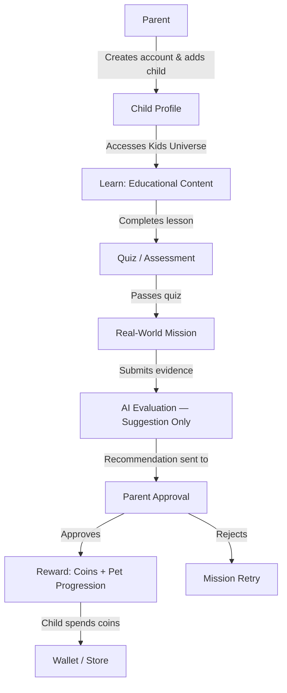
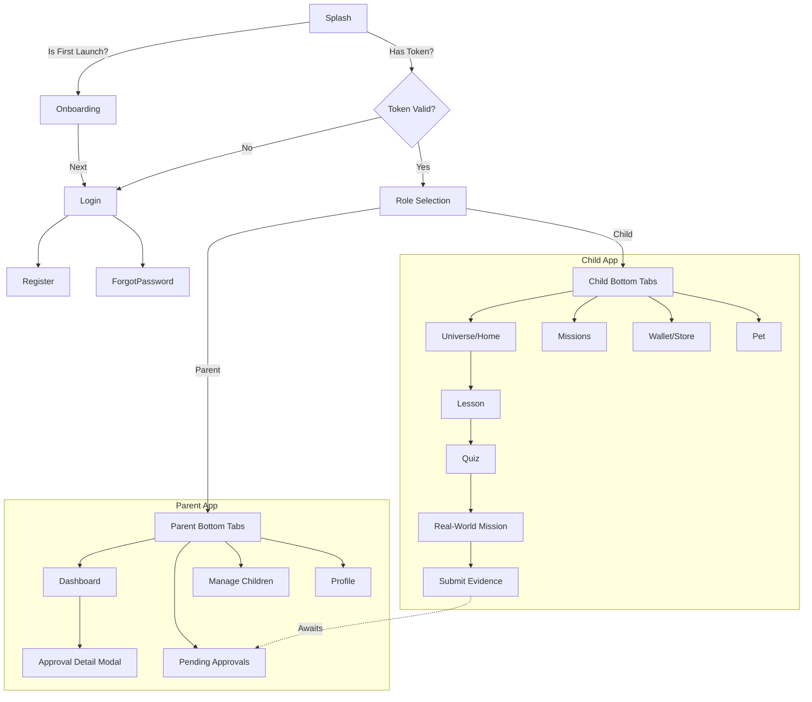

# KidLife — Project Context (Single Source of Truth)

> **For AI Agents:** Read ONLY this file before starting any task. Do NOT scan the repository unless absolutely necessary. After every task, update this file to keep it synchronized.

---

## 1. Project Overview

| Field | Value |
|---|---|
| **Project Name** | KidLife |
| **Description** | EdTech + Parenting app with a screen-light, action-heavy philosophy |
| **Business Goal** | Help children learn and apply knowledge in real life through missions, while keeping parents in control of approvals and rewards |
| **Target Users** | Parents + Children (ages ~6–14) |
| **Current Version** | v1.0.0-alpha (Foundation Phase) |
| **Current Phase** | Core Infrastructure |
| **Last Completed Task** | Task 04.9 — Navigation Foundation Freeze & Release v1.0 |
| **Current Progress** | ~30% (Foundation + Theme + Navigation complete) |
| **Architecture Status** | 🔒 Frozen — Do NOT change folder structure or architecture |

---

## 2. Business Flow



> ⚠️ **CRITICAL RULE:** AI acts ONLY as a suggestion engine. AI NEVER makes the final approval decision. The parent always has final authority.

---

## 3. System Architecture

### Pattern
- **Frontend-only currently.** Backend is planned (Node.js/Express + MongoDB).
- **Feature-Based Architecture** — code is grouped by business domain, not by type.
- **Strict Data Flow:** Screen → Hook → API Layer → Axios Instance → Backend. Business logic must NEVER live in UI components.
- **Dependency Direction:** Features may depend on `@/theme`, `@/components`, `@/hooks`, `@/utils`. Features must NOT depend on other features.

### Layer Responsibilities

| Layer | Responsibility | Rule |
|---|---|---|
| **Screens** | Presentation only — layout, rendering | No business logic, no API calls |
| **Hooks** | Connect UI to state/data | No direct Axios calls, no JSX |
| **API layer** | Typed data fetching functions | Uses only the global `axiosInstance` |
| **Redux Store** | Global synchronous client state | No server state (use TanStack Query) |
| **TanStack Query** | Server state — caching, loading, refetching | No local UI state |

---

## 4. Technology Stack

| Technology | Purpose | Why Selected |
|---|---|---|
| **Expo SDK 57** | React Native framework + build tooling | OTA updates, rich native module ecosystem, fast iteration |
| **React Native** | Cross-platform mobile UI | Single codebase for iOS + Android |
| **TypeScript (strict)** | Type safety | Catch errors at compile time, not runtime |
| **React Navigation** | App navigation | Imperative control for bifurcated Parent/Child flows (hard to model in Expo Router) |
| **Redux Toolkit** | Global client state | Current user profile, selected child, app settings across deeply nested features |
| **TanStack Query** | Server state / API caching | Zero boilerplate caching, background refetch, loading state |
| **Axios** | HTTP client | Centralized JWT injection + 401 refresh interceptor |
| **React Hook Form** | Form state management | Performant, minimal re-renders |
| **Zod** | Schema validation | Runtime-safe type-checked data validation |
| **expo-secure-store** | Encrypted token storage | Secure JWT persistence on-device |
| **ESLint v8 + Prettier** | Code quality + formatting | Consistent style, automated enforcement |

---

## 5. Folder Structure

```
src/
├── assets/        Static files (images, fonts). No remote URLs. No dynamic files.
├── components/    Reusable, generic UI components. No business logic. No feature-specific code.
├── configs/       App environment configs (expo-constants). No API endpoints.
├── constants/     Static constants (keys, dimension values). No dynamic state.
├── features/      Self-contained feature modules (auth, lesson, mission, parent, child…)
│   └── [feature]/ Each feature contains its own: screens/, hooks/, api/, components/
├── hooks/         Global custom hooks only. No feature-specific hooks.
├── navigation/    Navigators and routing config only. No UI screens.
├── providers/     Global context wrappers (Redux, TanStack, SafeArea, Gesture).
├── services/      External integrations (Axios instance). No React components.
├── store/         Global Redux store configuration. No local feature state.
├── theme/         Design system tokens — the single source of all styling values.
├── types/         Global TypeScript interfaces and enums.
└── utils/         Pure helper functions. No side-effects. No state.
```

**Critical Rules:**
- Features CANNOT import from other features.
- Components CANNOT contain business logic.
- Screens CANNOT call Axios directly.
- All styling values MUST come from `@/theme`.

---

## 6. Theme System

> 🔒 **FROZEN** — Do NOT modify `src/theme/` unless adding a genuinely missing token. All tokens must remain semantic.

### Architecture: Primitives → Semantics → Components

```
Base Token (raw value)  →  Semantic Role (intent)  →  UI Component (consumes only semantic)
     fontSize[16]       →    bodyLarge.fontSize     →    <Text style={theme.typography.bodyLarge}/>
     palette.rose[500]  →    colors.error.main      →    <Text color={theme.colors.error.main}/>
     spacing.lg (16px)  →    layout.screenPadding   →    <View padding={theme.spacing.layout.screenPadding}/>
```

### Theme Folder Map

| Folder | Contents | Status |
|---|---|---|
| `colors/palette.ts` | Raw hex primitives | ✅ Complete |
| `colors/semantic.ts` | SemanticColors interface | ✅ Complete |
| `colors/light.ts` & `dark.ts` | Theme mappings | ✅ Complete |
| `typography/` | fontFamily, fontWeight, fontSize, lineHeight, letterSpacing, textStyle | ✅ Complete |
| `spacing/` | spacing scale (4px grid), layout wrappers, safeArea | ✅ Complete |
| `radius/` | radius scale, shape semantic wrappers | ✅ Complete |
| `shadow/` | cross-platform shadow presets + Android elevation | ✅ Complete |
| `opacity/` | interaction state transparencies | ✅ Complete |
| `animation/` | duration + easing tokens | ✅ Complete |
| `zIndex/` | layering scale (modal, overlay, toast…) | ✅ Complete |
| `types/index.ts` | AppTheme interface linking all modules | ✅ Complete |

### AppTheme Object Shape
```ts
theme.colors.*        // Semantic colors (primary, surface, text, error…)
theme.typography.*    // Semantic text styles (displayLarge, bodyMedium…)
theme.spacing.*       // base scale + layout wrappers
theme.radius.*        // base scale + shape wrappers (button, card, avatar…)
theme.shadows.*       // presets (floating, card, modal) + elevation
theme.opacity.*       // hover, pressed, disabled, overlay, backdrop
theme.animation.*     // duration (fast/normal/slow) + easing curves
theme.zIndex.*        // base, dropdown, header, modal, overlay, toast
theme.breakpoints.*   // (placeholder — not yet implemented)
theme.icons.*         // (placeholder — not yet implemented)
```

### Key Theme Rules
- **NEVER** hardcode: `color`, `fontSize`, `padding`, `margin`, `borderRadius`, `elevation`, `opacity`, `zIndex`
- **ALWAYS** use semantic tokens: `theme.colors.primary.main`, `theme.spacing.layout.cardPadding`
- **NEVER** import deep: ❌ `import { spacing } from '@/theme/spacing/spacing'`
- **ALWAYS** import from root: ✅ `import { ... } from '@/theme'`
- **NEVER** access `palette` in components — only semantic color keys
- **DO NOT** tweak a semantic text style inline. Pick the closest semantic role instead.

### Token Quick Reference

**Spacing Scale:** `none(0)` `xxs(2)` `xs(4)` `sm(8)` `md(12)` `lg(16)` `xl(20)` `2xl(24)` → `12xl(128)`

**Radius Scale:** `none(0)` `xs(2)` `sm(4)` `md(8)` `lg(12)` `xl(16)` `2xl(24)` `full(9999)`

**Typography Roles:** `displayLarge` `displayMedium` `displaySmall` `headlineLarge` `headlineMedium` `headlineSmall` `titleLarge` `titleMedium` `titleSmall` `bodyLarge` `bodyMedium` `bodySmall` `labelLarge` `labelMedium` `labelSmall` `caption` `overline`

**Shadow Presets:** `none` `xs` `sm` `md` `lg` `xl` `2xl` `floating` `modal` `card` `dropdown`

**Opacity Tokens:** `transparent(0)` `hover(0.08)` `pressed(0.12)` `disabled(0.38)` `overlay(0.4)` `loading(0.5)` `backdrop(0.6)` `opaque(1)`

**Z-Index Scale:** `base(0)` `dropdown(100)` `sticky(200)` `header(300)` `fab(400)` `bottomSheet(500)` `modal(1000)` `overlay(1100)` `toast(1200)` `tooltip(1300)`

**Animation Duration:** `instant(0ms)` `fast(150ms)` `normal(300ms)` `slow(500ms)` `verySlow(1000ms)`

### Usage Example
```tsx
const CustomCard = () => {
  const theme = useTheme();
  return (
    <View style={{
      backgroundColor: theme.colors.surface.main,
      padding: theme.spacing.layout.cardPadding,
      borderRadius: theme.radius.shape.card,
      ...theme.shadows.presets.card,
    }}>
      <Text style={{
        ...theme.typography.titleMedium,
        color: theme.colors.text.primary,
        marginBottom: theme.spacing.base.sm,
      }}>Card Title</Text>
    </View>
  );
};
```

---

## 7. Module Progress

| Module | Status | Progress | Notes |
|---|---|---|---|
| **Foundation** | ✅ Complete | 100% | Expo SDK 57, TS strict, ESLint |
| **Repository** | ✅ Complete | 100% | Conventional commits, branch strategy |
| **Theme** | ✅ Complete | 100% | All tokens implemented, QA passed, frozen |
| **Navigation** | ✅ Complete | 100% | Foundation completed, types & hooks ready |
| **Redux** | 🏗️ Structure only | 10% | Store configured, no slices yet |
| **Axios** | 🏗️ Structure only | 10% | Instance created, no endpoints yet |
| **Authentication** | ⏳ Not started | 0% | — |
| **Parent Dashboard** | ⏳ Not started | 0% | — |
| **Child (Kids Universe)** | ⏳ Not started | 0% | — |
| **Lesson** | ⏳ Not started | 0% | — |
| **Mission** | ⏳ Not started | 0% | — |
| **Submission** | ⏳ Not started | 0% | — |
| **Wallet / Rewards** | ⏳ Not started | 0% | — |
| **Pet System** | ⏳ Not started | 0% | — |
| **AI Evaluation** | ⏳ Not started | 0% | Suggestion-only role |
| **Report** | ⏳ Not started | 0% | — |
| **Notification** | ⏳ Not started | 0% | FCM planned |
| **Payment** | ⏳ Not started | 0% | — |
| **Testing** | ⏳ Not started | 0% | — |
| **Deployment** | ⏳ Not started | 0% | — |

---

## 8. Architecture Decisions

| Decision | Reason | Impact | Status |
|---|---|---|---|
| **Feature-based architecture** | Infinite scalability; prevents merge conflicts in monolithic folders | Every new module must live in `src/features/[domain]/` | ✅ Accepted |
| **React Navigation (not Expo Router)** | Parent/Child flows require imperative access control; file-based routing cannot enforce this cleanly | Navigation lives in `src/navigation/` only | ✅ Accepted |
| **TanStack Query + Redux split** | Server state and client state have fundamentally different behaviors | API data = TanStack Query; UI state = Redux | ✅ Accepted |
| **Global Axios Instance** | Centralized JWT injection and 401 refresh logic | Screens → Hooks → typed API fn → `axiosInstance` | ✅ Accepted |
| **Centralized Theme** | Decouple UI from hardcoded values; enable dark mode + white-labeling | All styling must use `@/theme` tokens | ✅ Accepted |
| **Semantic Color Naming** | Colors named by intent (not appearance) scale across themes and brands | `theme.colors.error`, never `theme.colors.red` | ✅ Accepted |
| **Semantic Typography Roles** | Enforce vertical rhythm; prevent arbitrary font combinations | All `<Text>` uses `theme.typography.[role]` | ✅ Accepted |
| **Layout + Shape Semantic Wrappers** | Allow global redesigns without touching component code | Prefer `theme.spacing.layout.cardPadding` over base scale | ✅ Accepted |
| **Centralized Visual Tokens** | Prevent z-index wars and inconsistent opacity/shadow states | All visual properties from `@/theme` | ✅ Accepted |
| **Theme Architecture Freeze** | Theme is fully typed and QA-verified; scope creep prevention | Do NOT modify `src/theme/` without explicit justification | ✅ Accepted |
| **Freeze UI Foundation** | Foundation completed | Future modules must consume reusable components. | ✅ Accepted |
| **Freeze Navigation Foundation** | Navigation architecture completed | Future Authentication, Redux, Business Features must consume Navigation Foundation. | ✅ Accepted |

---

## 9. Development Rules

### Code Rules
1. **Zero Magic Numbers** — Every color, size, radius, opacity, duration, zIndex must exist in `@/theme`
2. **No hardcoded colors** — Never use hex codes in components
3. **No inline business logic** — Components are dumb presentational layers
4. **No cross-feature imports** — Features must not import from other features
5. **No Axios in screens** — Follow: Screen → Hook → API fn → axiosInstance
6. **TypeScript strict mode** — No `any`, no implicit types, no type assertions without justification
7. **Feature Architecture** — All new modules go in `src/features/[domain]/`
8. **No deep theme imports** — Always import from `@/theme`, never from sub-files
9. **Frozen modules are immutable** — Do NOT modify completed architecture unless fixing a verified bug

### Theme-Specific Rules
- Never override `lineHeight` of a semantic text style inside a component
- Shadows must be spread: `...theme.shadows.presets.card` (React Native requires spread for shadow objects)
- Use `StyleSheet.create` for static styles; inject theme values via array spreading
- Complex styles that depend on theme should be memoized with `useMemo`

---

## 10. Git Workflow

### Branch Strategy
- `main` — production-ready code only
- `develop` — integration branch
- `feature/[task-name]` — individual feature branches

### Commit Convention (Conventional Commits)
```
feat(scope): description      # New feature
fix(scope): description       # Bug fix
docs(scope): description      # Documentation only
refactor(scope): description  # Code change without feature/fix
chore(scope): description     # Build, config, tooling
test(scope): description      # Tests
```

### Repository Rules
- One Prompt = One Commit
- Never commit directly to `main`
- All commits must pass lint + typecheck

---

## 11. Installed Packages

| Package | Purpose | Status |
|---|---|---|
| `expo` / `react-native` | Core framework | ✅ Installed |
| `@react-navigation/native` + stacks | Routing | ✅ Installed |
| `@reduxjs/toolkit` + `react-redux` | Global client state | ✅ Installed |
| `@tanstack/react-query` | Server state / caching | ✅ Installed |
| `expo-secure-store` | Encrypted token storage | ✅ Installed |
| `eslint` v8 + `prettier` | Code quality | ✅ Installed |
| `eslint-plugin-prettier` + `eslint-config-prettier` | Prettier-ESLint bridge | ✅ Installed |

---

## 12. Current State

### ✅ Completed
- Expo SDK 57 project initialized with strict TypeScript
- ESLint v8 + Prettier fully configured
- Feature-based folder structure created
- UI Foundation Architecture folders created
- Global Provider architecture (Redux, TanStack Query, SafeArea, GestureHandler)
- AI Memory System (documentation)
- Complete Theme System:
  - Semantic Color System (palette → semantic → light/dark)
  - Typography System (base tokens → semantic text style roles)
  - Spacing System (4px/8px grid → layout semantic wrappers)
  - Radius System (scale → shape semantic wrappers)
  - Visual Tokens (shadow, opacity, animation duration/easing, zIndex)
  - Theme QA: 0 ESLint errors, 0 TypeScript errors
  - Theme Architecture officially frozen

### ✅ Completed
- Expo SDK 57 project initialized with strict TypeScript
- ESLint v8 + Prettier fully configured
- Feature-based folder structure created
- UI Foundation Architecture frozen (v1.0)
- Navigation Foundation Architecture frozen (v1.0)
- Global Provider architecture (Redux, TanStack Query, SafeArea, GestureHandler)
- Complete Theme System frozen

### ⏳ Waiting for Next Prompt
- Auth feature implementation (login, register, token refresh)
- Navigation structure (Parent stack vs Child stack)
- Parent Dashboard UI
- Kids Universe UI
- All remaining features (Lesson, Mission, Wallet, Pet, Report, etc.)

---

## 13. Next Task

- **Completed Prompt:** 04.9
- **Next Prompt:** 05 State Management Foundation
- **Expected Goal:** Begin State Management Foundation implementation
- **Acceptance Criteria for any future task:**
  1. Uses theme tokens exclusively — no magic numbers
  2. Follows feature-based architecture — no cross-feature imports
  3. TypeScript strict mode passes
  4. ESLint passes with 0 errors
  5. Updates this `PROJECT_CONTEXT.md` file upon completion

---

## 14. Known Issues & Technical Debt

| Issue | Severity | Notes |
|---|---|---|
| `ThemeBreakpoints` and `ThemeIcons` are empty interface placeholders | Low | Suppress with `eslint-disable` comment; will be populated when responsive + icon systems are implemented |
| No actual custom fonts loaded | Low | `fontFamily` tokens use `'System'` as placeholder; must be updated when brand fonts are added |
| `safeArea` token values are all `0` | Low | Actual values should be provided by `react-native-safe-area-context` at runtime |
| No dark theme provider wired up | Medium | Dark theme tokens exist but no `ThemeProvider` / `useColorScheme` hook has been implemented yet |
| No actual navigation screens | Medium | Navigation structure is scaffolded but contains no screens |
| `src/theme/light/`, `dark/`, `helpers/`, `icons/`, `breakpoints/` are skeleton placeholders | Low | Export empty objects; are re-exported from `src/theme/index.ts`; will be populated in future tasks |

---

## 15. AI Instructions

> **MANDATORY — Every AI agent must follow these rules without exception.**

### Before Starting Any Task
1. **Read ONLY this file** (`docs/PROJECT_CONTEXT.md`)
2. Do NOT scan the entire repository
3. Do NOT read other files unless absolutely necessary for the specific task
4. Understand the current architecture (Section 3)
5. Identify what is frozen vs. pending (Section 7 & 12)
6. Confirm what the next task is (Section 13)

### During Every Task
- Do NOT modify any completed/frozen modules (Theme, Foundation)
- Do NOT rename folders or change the architecture
- Do NOT create UI components unless the task explicitly requests it
- Do NOT hardcode any design values — use `@/theme` tokens
- Every new feature goes in `src/features/[domain]/`
- Every file must pass TypeScript strict + ESLint

### After Finishing Any Task
1. **Update Section 7** (Module Progress table)
2. **Update Section 12** (Current State — Completed / In Progress / Waiting)
3. **Update Section 13** (Next Task)
4. **Update Section 1** (Last Completed Task + Current Progress %)
5. If architecture decisions were made, **update Section 8**
6. If new packages were installed, **update Section 11**
7. If new issues were discovered, **update Section 14**

### This file is the ONLY trusted source of project context.
### Do NOT create additional documentation files unless explicitly instructed by the developer.

---

## 16. UI Foundation

### Architecture
The UI Foundation architecture provides a scalable, reusable, and accessible component library for the application. It strictly decouples UI components from business logic.

### Folder Structure & Responsibility
| Folder | Responsibility | Examples |
|---|---|---|
| ase/ | Primitive components | Button, Text, Pressable, IconButton |
| display/ | Visual elements | Avatar, Image, Icon, Logo, Badge |
| orms/ | User input | Input, Checkbox, Switch, OTP, Search, Select, Radio |
| eedback/ | System status | Loading, Skeleton, Progress, Empty, Error, Toast, Snackbar |
| layout/ | Structural elements | Container, Screen, Divider, Spacer, SafeArea, Section |
| overlay/ | Elements appearing above content | Modal, Dialog, BottomSheet, Popover, Tooltip |
| 
avigation/ | UI navigation components | Header, AppBar, NavigationItem, TabBar, DrawerHeader |
| providers/ | UI context providers | Portal, Modal, Toast |
| hooks/ | Reusable UI hooks | useKeyboard, useDisclosure |
| 	ypes/ | Shared UI interfaces | BaseComponentProps |
| styles/ | Shared reusable styles | Common shadows or text resets |
| utils/ | Pure UI helper functions | getIconSize, getContrastColor |

### Dependency Rules
- **Allowed:** React, React Native, Theme, Types, Utils, Hooks.
- **Forbidden:** Redux, Axios, Authentication, Features, Business Logic, API.

### Component Rules
Every UI component MUST:
- Use Theme ONLY (no magic numbers).
- Support 	estID, ccessibilityLabel, ccessibilityRole.
- Support style override via style prop.
- Support orwardRef.
- Support memoization (React.memo) where appropriate.
- Contain NO business logic.
- Use strict TypeScript.

### Export Strategy
- Every component exports from its own folder's index.ts.
- The root src/components/index.ts exports all public components.
- **NO deep imports:** import { Button } from '@/components' is allowed, import { Button } from '@/components/base/Button' is forbidden.

### Accessibility Rules
Prepared for: Screen Readers, Dynamic Font Size, Accessibility Labels, Accessibility Hints, Accessibility Roles, Keyboard Navigation, Reduced Motion, High Contrast.

### Testing Rules
Every future UI component must support: Unit Testing, Snapshot Testing, Accessibility Testing.

### Current Status
- 🏗️ Architecture folders created.
- 🔒 Architecture is FROZEN. Do not change structure, only add components.

### Implemented Components
- ✅ **Base Text**: Completed.
  - **Supported Props**: `variant`, `color`, `align`, `children`, and all standard `TextProps` (`numberOfLines`, `allowFontScaling`, etc.).
  - **Supported Variants**: All Theme typography roles (`displayLarge` down to `overline`).
  - **Usage Rules**: Use `variant` for typography, `color` for semantic color, `align` for text alignment. Do not hardcode styles.

- ✅ **Base Button**: Completed.
  - **Supported Props**: `title`, `children`, `variant`, `size`, `disabled`, `loading`, `leftIcon`, `rightIcon`, `fullWidth`.
  - **Supported Variants**: `primary`, `secondary`, `outline`, `ghost`, `text`, `danger`, `success`, `warning`.
  - **Supported Sizes**: `xs`, `sm`, `md`, `lg`, `xl`.
  - **Usage Rules**: Always use this component instead of `Pressable` or `TouchableOpacity`. Colors, radii, typography, spacing, and opacity come exclusively from the Theme.

- ✅ **Base Input**: Completed.
  - **Supported Props**: `label`, `helperText`, `errorMessage`, `variant`, `size`, `disabled`, `readOnly`, `leftAccessory`, `rightAccessory`, `success`, plus all standard `TextInputProps`.
  - **Supported Variants**: `outlined`, `filled`, `underlined`.
  - **Supported Sizes**: `sm`, `md`, `lg`.
  - **Supported States**: `default`, `focused`, `disabled`, `error`, `success`, `readOnly`.
  - **Usage Rules**: Always use this component instead of `TextInput`. Do not include validation logic inside; only pass UI states (`errorMessage`, `success`). Uses `Base Text` internally for labels and helpers.

- ✅ **Base Container**: Completed.
  - **Supported Props**: `children`, `style`, `variant`, `backgroundColor`, `padding`, `paddingHorizontal`, `paddingVertical`, `margin`, `marginHorizontal`, `marginVertical`, `flex`, `center`, `safe`, `scrollable`, `testID`.
  - **Supported Variants**: `default`, `surface`, `transparent`.
  - **Usage Rules**: Use this component as the root layout for every screen. Do not use plain `View` or `SafeAreaView` for screen roots. All paddings and background colors rely on Theme tokens.
  - **Best Practices**: Prefer `safe` prop for screen roots to handle safe areas automatically. Wrap screen contents inside `Container` instead of reinventing layout padding.

- ✅ **Base Screen**: Completed.
  - **Supported Props**: `children`, `scrollable`, `safeArea`, `backgroundColor`, `statusBarStyle`, `keyboardAware`, `contentContainerStyle`, `style`, `header`, `footer`, `loading`, `testID`.
  - **Usage Rules**: Every feature screen in the application must inherit from this component. It centralizes Safe Area, Status Bar, Keyboard handling, and scrolling logic. Do not build screens using bare `View` or `SafeAreaView`.
  - **Best Practices**: Use `header` and `footer` props for fixed elements above or below the scrollable content. Use `scrollable={true}` for screens where content might exceed viewport height.

- ✅ **Base Card**: Completed.
  - **Supported Variants**: `filled`, `outlined`, `elevated`, `ghost`, `interactive`.
  - **Supported Props**: `children`, `variant`, `size`, `padding`, `header`, `footer`, `leftAccessory`, `rightAccessory`, `loading`, `disabled`, `pressable`, `onPress`, `style`, `contentStyle`, `backgroundColor`, `borderColor`, `shadow`, `radius`, `testID`.
  - **Usage Rules**: The Card component must be used as the standard container for displaying grouped information across all feature modules. Never build cards directly inside feature modules using raw Views. Consume Theme exclusively for spacing, colors, and shadows.

- ✅ **Base Avatar**: Completed.
  - **Supported Sizes**: `xs`, `sm`, `md`, `lg`, `xl`, `2xl`.
  - **Variants**: `circle`, `rounded`, `square`.
  - **Fallback Rules**: `Image (source/uri) -> Initials (name/initials) -> Placeholder -> '?'`.
  - **Usage Rules**: The Avatar component is the ONLY avatar component used throughout the application. Never render `Image` directly for user avatars. Supports online indicators, custom badges, and pressable states.

- ✅ **Base Badge**: Completed.
  - **Supported Variants**: `filled`, `outlined`, `soft`, `ghost`, `dot`.
  - **Supported Colors**: `primary`, `secondary`, `success`, `warning`, `error`, `info`, `neutral`.
  - **Supported Sizes**: `xs`, `sm`, `md`, `lg`.
  - **Usage Rules**: The Badge component is the ONLY badge component used across the application. Never hardcode badge styles inside feature modules. Supports numeric values, labels, custom icons, and fully interactive modes.

- ✅ **Feedback Components (Loading, Skeleton, Progress)**: Completed.
  - **Loading Supported Variants**: `inline`, `fullscreen`, `overlay`.
  - **Skeleton Supported Variants**: `text`, `avatar`, `card`, `button`, `input`, `rectangle`, `circle`, `rounded`.
  - **Progress Supported Variants**: `linear`, `circular` (placeholder).
  - **Usage Rules**: Use `Skeleton` for optimistic placeholder UI. Use `Loading` for blocking UI feedback while awaiting operations. Use `Progress` for determinate tracking (like XP progress) or indeterminate operations.

- ✅ **Empty & Error States**: Completed.
  - **EmptyState Supported Variants**: `default`, `search`, `offline`, `achievement`, `mission`, `notification`, `wallet`.
  - **ErrorState Supported Variants**: `default`, `offline`, `server`, `permission`, `unknown`.
  - **Usage Rules**: Use for displaying fallbacks when no data is available or when an error occurs. Never implement custom empty/error UI inside feature modules.

- ✅ **Overlay Components (Modal, Dialog)**: Completed.
  - **Modal Supported Variants**: `default`, `fullscreen`, `bottom`, `center`.
  - **Dialog Supported Variants**: `info`, `success`, `warning`, `error`, `confirm`, `custom`.
  - **Usage Rules**: Modal is the foundation for full-screen overlays, popups, and bottom sheets. Dialog is built on top of Modal for quick confirmations and messages. Never use React Native Modal directly inside feature modules.

## UI Foundation Review

The UI Foundation has undergone a comprehensive Quality Assurance review and is now considered **Frozen** for production use. All components strictly adhere to the project's Theme system and Accessibility guidelines.

### Implemented Components

| Category | Components | Status |
|---|---|---|
| **Base** | `Text`, `Button` | ✅ Production Ready |
| **Forms** | `Input` | ✅ Production Ready |
| **Layout** | `Container`, `Screen` | ✅ Production Ready |
| **Display** | `Card`, `Avatar`, `Badge` | ✅ Production Ready |
| **Feedback** | `Loading`, `Skeleton`, `Progress`, `EmptyState`, `ErrorState` | ✅ Production Ready |
| **Overlay** | `Modal`, `Dialog` | ✅ Production Ready |

### Architecture Summary

- **Theme-Driven Design**: All components dynamically consume `AppTheme` tokens (colors, spacing, typography, radius, shadow) via the mock `useTheme` hook. Hardcoded values are strictly forbidden.
- **Type Safety**: 100% strict TypeScript coverage. Explicit type definitions for Props and Variants. `any` types are actively avoided or explicitly bypassed with ESLint overrides only when interfacing with React Native Animated internal types.
- **Performance Optimization**: Components are memoized using `React.memo` and forward their refs via `React.forwardRef()`. Re-renders are minimized by splitting out heavy stylesheet computations (e.g. `get*Styles(theme)`).
- **Accessibility Integration**: Accessibility roles (`header`, `button`, `summary`, `alert`, `dialog`) are proactively applied. Visual-only elements use `accessibilityElementsHidden={true}` and `importantForAccessibility="no"` to prevent screen reader noise.

### Developer Guide

#### Component Rules
1. **Never mutate foundation components**: If a feature requires a drastically different look, compose existing components rather than modifying the core files.
2. **Never hardcode styles**: Always use the Theme tokens. If a color is missing, it must be added to the Theme, not hardcoded into the component.
3. **Always use Semantic Variants**: Components like `Badge`, `Button`, and `Dialog` expose variants (`success`, `warning`, `error`). Use these instead of manually overriding colors.

#### Usage Rules
- `Screen` must be the root element of every feature screen.
- `Container` must be used inside `Screen` to enforce standard padding and max-widths.
- Never use React Native's `Text`, `Button`, or `Modal` directly in feature modules. Always import them from `@/components`.

#### Best Practices
- **Loading States**: Use `Skeleton` for optimistic UI and `Loading` (overlay/fullscreen) for blocking async operations.
- **Error Handling**: Use `ErrorState` for data-fetching failures and `Dialog` (`variant="error"`) for action-based failures.
- **Empty States**: Use `EmptyState` when a list or query returns no data.

#### Common Mistakes
- ❌ Passing `style={{ padding: 20 }}` instead of `style={{ padding: theme.spacing.base.xl }}`.
- ❌ Using `<Text>` from `react-native` instead of `<Text variant="bodyMedium">` from `@/components`.
- ❌ Building custom modals with `absolute` positioning instead of using the `Modal` or `Dialog` component.

#### Future Components
- **Input Forms**: Advanced form controls (Select, Checkbox, Radio, DatePicker) are scheduled for the next phase.
- **Bottom Sheet**: A swipeable bottom sheet component built on top of `Modal` or a dedicated library like `@gorhom/bottom-sheet`.
- **Toast**: Transient alert messages for non-blocking notifications.

## Debugging & Bug Fixes

### Runtime Startup Crash 1: Redux Store Initialization
- **Problem**: The app compiled successfully but crashed immediately and returned to the Expo Go home screen.
- **Root Cause**: `src/store/index.ts` initialized `configureStore` with an empty `reducer: {}` object. Redux Toolkit's `combineReducers` requires at least one valid reducer. Without it, the state initialization throws a fatal JavaScript exception before React Native can render the first frame.
- **Fix**: Added a `_dummy: (state = {}) => state` reducer to the `configureStore` configuration to satisfy Redux Toolkit's requirements until feature slices are implemented.

### Runtime Startup Crash 2: Android TaskDescription Color
- **Problem**: The app still crashed on Android emulator after the Splash Screen.
- **Root Cause**: `adb logcat` revealed a fatal Android Runtime error: `java.lang.RuntimeException: A TaskDescription's primary color should be opaque`. This occurs when the OS tries to color the app switcher header, but the app's `primaryColor` or splash screen background is either missing or transparent, which is forbidden on modern Android versions.
- **Fix**: Explicitly added `"primaryColor": "#3B82F6"` and a fully opaque `"splash": { "backgroundColor": "#FFFFFF" }` configuration to `app.json`.

### Runtime Startup Crash 3: React Native Gesture Handler
- **Problem**: The app crashed with an unhandled `SoftException`: `Cannot get UIManager because the context doesn't contain an active React instance`.
- **Root Cause**: `react-native-gesture-handler` was missing its required global initialization import at the very top of the app entry point. Without this, the native module fails to bind to the React root view before the UI thread attempts to render it, crashing the JS bridge.
- **Fix**: Added `import 'react-native-gesture-handler';` as the very first line in `index.ts` (before `registerRootComponent`).

---

## 18. UI Foundation Status

| Field | Status |
|---|---|
| **Version** | 1.0 |
| **Status** | FROZEN |
| **Architecture** | Frozen |
| **Developer Showcase** | ❌ Removed |

**Completed Components:**
`Text`, `Button`, `Input`, `Container`, `Screen`, `Card`, `Avatar`, `Badge`, `Loading`, `Skeleton`, `Progress`, `EmptyState`, `ErrorState`, `Modal`, `Dialog`.

**Future Rule:**
Future prompts must consume the UI Foundation. They must NOT modify it unless there is a critical bug or an architecture change approved by the developer.

---

## 19. Changelog

- **[Phase C]** UI Foundation Version 1.0 Frozen. Ready for Navigation Foundation.
- **[Phase D]** Navigation Foundation Architecture Created (Types, Hooks, Root/App/Tab/Modal Stacks).
- **[Phase D]** Navigation Foundation Version 1.0 Frozen. Ready for State Management Foundation.

---

## 20. Navigation Foundation

### Architecture
The Navigation Foundation establishes the routing backbone for KidLife using React Navigation v7. It strictly separates navigation structure from feature screens and implements full type safety. No `any` types are used.

### Folder Structure
```
src/navigation/
├── constants/         # Route names, Navigator names
├── types/             # Strict TypeScript definitions for all ParamLists
├── NavigationService/ # Global navigation reference for outside-React usage
├── StackNavigator/    # Main App Stack (Push, Replace, Reset flows)
├── TabNavigator/      # Bottom Tab Bar (Home, Learn, Rewards, Profile)
├── ModalNavigator/    # Transparent modals and dialogs
├── RootNavigator/     # Top-level container combining App Stack and Modals
├── hooks/             # Typed wrappers for useNavigation and useRoute
└── utils/             # Helper functions for deep linking or state parsing
```

### Root Navigation & Navigation Container
- `RootNavigator` wraps the entire app with `NavigationContainer`.
- **Theme Integration:** Maps `@/theme` tokens to React Navigation's `DefaultTheme` to ensure system-wide consistency.
- **Deep Linking:** Configures `linking` prefixes (`kidlife://`) and placeholder maps for nested routing.
- **Placeholder Strategy:** Uses a generic `PlaceholderScreen` to satisfy missing Stacks (like Auth, Splash, Developer) without premature business logic.

### Stack Navigator Architecture
- Divided into specialized stacks: `AuthStack`, `MainStack`, `AppStack`, `DeveloperStack`, and `ModalStack`.
- **Options Centralization:** Navigation options (`defaultScreenOptions`, `modalScreenOptions`) are centralized in `StackNavigator.types.ts` to ensure consistent header behaviors and transitions across the app.
- **App Stack:** Connects to `MainStack` (which will eventually hold Bottom Tabs and primary navigation) for logged-in user experience.

### Bottom Tab Foundation
- Managed by `BottomTabNavigator`, intended for primary app navigation.
- **Data-Driven Configuration:** Tabs are rendered dynamically based on `TAB_CONFIG` array, supporting future RBAC and Feature Flag filtering.
- **Centralized UI:** Standardized tab icons (`BottomTab.icons.ts`) and global styles mapping directly to `@/theme`.
- **Placeholder Strategy:** Uses `PlaceholderScreen` to stand in for `Home`, `Learn`, `Rewards`, and `Profile` screens until implementation.

### Modal Navigation & Presentation Layer
- **Dedicated ModalNavigator:** Extracted into its own layer (`ModalNavigator`) to provide isolated overlay renderings across the entire app.
- **Presentation Modes Centralized:**
  - `transparentModalOptions`: For standard Dialogs and Confirmations (fade animation, transparent background).
  - `fullScreenModalOptions`: For immersive content like Image Previews.
  - `cardModalOptions`: Standard iOS card presentation for future data-entry forms.
  - `containedModalOptions`: Formats for floating contained popups, mapping `@/theme` shadow and radius.

### Global Navigation Service
- Extracted into a centralized service (`NavigationService`) providing the global `navigationRef`.
- **Safety First:** Utilizes `isReady()` and `safeAction()` wrappers to prevent runtime crashes when triggering navigation outside the React tree (e.g., from background notifications, API interceptors, or Deep Links).
- **Type-Safe API:** Wraps standard methods (`navigate`, `replace`, `push`, `reset`, etc.) explicitly mapped to the frozen `RootStackParamList`.
- **Usage Rule:** *Never* invoke raw navigation objects outside of React components. Always import and use `NavigationService.navigate(...)`.

### Deep Linking Foundation & Navigation Recovery
- **Centralized Configuration:** Defined `appLinkingConfig` mapping schemes (`kidlife://`) and universal domains statically to `RootStackParamList`.
- **Navigation Recovery:** Implemented `NavigationRecovery` service to pause and resume routing intents (crucial for redirecting back to a target after forced authentication).
- **Navigation Persistence:** Setup `NavigationPersistence` architecture ready for future `AsyncStorage` injection, ensuring session state can survive cold restarts.
- **Safe Utilities:** Built `safeHandleDeepLink` and `safeOpenLink` to elegantly handle external URL errors without crashing the app.

---

## Navigation Foundation QA & Review (v1.0 Frozen)

### Architecture Summary
The Navigation Foundation successfully provides a fully modularized, strongly-typed routing ecosystem decoupled from business logic. The architecture maps perfectly to a mature React Native app pattern with decoupled Sub-Navigators.

### Folder Responsibilities
- `src/navigation/constants/`: Source of truth for all literal string identifiers (Routes, Navigators).
- `src/navigation/types/`: Centralized interfaces (`RootStackParamList`, `AppStackParamList`, etc.), preventing circular type imports.
- `src/navigation/RootNavigator/`: Orchestrates high-level flow (Splash vs Auth vs Main vs Modal).
- `src/navigation/StackNavigator/`: Handles nested stacks (Auth, App, Developer).
- `src/navigation/TabNavigator/`: Data-driven Tab configuration built to ingest RBAC logic in the future.
- `src/navigation/ModalNavigator/`: Manages cross-app overlays and specialized presentation forms.
- `src/navigation/NavigationService/`: Singleton escape hatch for non-React dispatches.
- `src/navigation/linking/`: Centralizes external entry points and routing state restoration.

### Navigation Rules & Best Practices
1. **Never Hardcode Route Names:** Always use `Navigators.*` and `Routes.*` from `constants`.
2. **Never Call Navigation Outside React Directly:** Use `NavigationService.navigate` instead of raw refs or passing `navigation` down via props.
3. **Keep UI Decoupled:** Use `@/theme` variables (no inline literal colors) in Navigator config.
4. **Data-Driven Tabs:** When adding a new Tab, append it to `TAB_CONFIG` in `BottomTabNavigator.tsx`, avoiding manual JSX `<Tab.Screen>` bloating.

### Common Mistakes
- *Violating Param Types:* Attempting to navigate to `Routes.Modal.Dialog` without passing `{ title, message }`.
- *Nesting Hell:* Exporting screens deeply rather than flat mapping them. Keep Stacks as flat as possible.
- *Circular Imports:* Importing a Navigator directly into the Types folder. Types must always be isolated.

### Future Integration Plan
- **Authentication:** `RootNavigator` will inject Redux state (`isAuthenticated`) to conditionally swap `AuthStack` and `AppStack`.
- **RBAC:** `TAB_CONFIG` will filter based on `permissions` and `featureFlag`.
- **Analytics:** Connect `NavigationContainer.onStateChange` to `firebase-analytics` in `RootNavigator`.
- **Storage:** Inject `MMKV` or `AsyncStorage` into `NavigationPersistence`.

### Dependency Rules
- **Allowed:** `React`, `React Native`, `@react-navigation/*`, `@/theme`, `@/components`, `@/types`.
- **Forbidden:** Redux, Auth flows, Axios, Business Features, API. Navigation Foundation must remain agnostic of feature logic.

### Future Flow
1. **Protected Routes:** Authentication stack will be added to `RootNavigator`.
2. **Deep Linking:** Configs will be added to `NavigationContainer` in `RootNavigator`.
3. **Feature Integration:** New screens will be registered in `constants/routes.ts` and `types/index.ts`. Architecture remains frozen, only routes are appended.

---

## 21. Navigation Types & Route Definitions

### Route Naming Convention
- Routes are grouped hierarchically in the `Routes` object: `Routes.Root`, `Routes.Auth`, `Routes.Main`, `Routes.Modal`.
- Navigators are grouped in the `Navigators` object: `Navigators.Root`, `Navigators.Auth`, `Navigators.Main`, `Navigators.Modal`.
- String literals are forbidden. Always use the constants from `src/navigation/constants`.

### Navigation Param Strategy
- `root.types.ts`: Types for the top-level root stack (including nested NavigatorScreenParams).
- `stack.types.ts`: Auth and App stack screen params.
- `tab.types.ts`: Bottom tab screen params.
- `modal.types.ts`: Modal screen params (e.g. title, message, callbacks).
- `navigation.types.ts`: Global React Navigation namespace augmentations.

### Type Safety Rules
- All ParamLists are strictly typed (0 `any` usage).
- Hook `useAppNavigation` comes fully pre-typed with `NativeStackNavigationProp<RootStackParamList>`.
- Hook `useAppRoute<RouteName>()` enforces strictly correct params based on the `RouteName`.

---

## 22. Navigation Foundation Status

| Field | Status |
|---|---|
| **Version** | 1.0 |
| **Status** | FROZEN |
| **Current State** | Stable, Reusable, Production Ready |

**Completed Modules:**
- Navigation Foundation
- Navigation Types
- Route Constants
- Navigator Constants
- Root Navigator
- Stack Navigator
- BottomTab Navigator
- Modal Navigator
- Navigation Service
- Navigation Ref
- Deep Linking Foundation
- Navigation Recovery
- Navigation Persistence

**Future Rule:**
All future prompts must consume Navigation Foundation. Navigation architecture must not be modified.

---

## 23. Figma Analysis & Frontend Development Planning

*(See `docs/FIGMA_ANALYSIS.md` for the full detailed analysis and screen inventory.)*

## 24. Sprint Executions

### Sprint FE-01: Authentication & Onboarding
- **Status**: ✅ Completed
- **Progress**: Added 6 new screens mapping the entire pre-authenticated flow.
- **Completed Screens**: 
  - `SplashScreen` (App initialization and token routing)
  - `OnboardingScreen` (Carousel presentation)
  - `LoginScreen` (Email/Password authentication)
  - `RegisterScreen` (New account creation)
  - `ForgotPasswordScreen` (Recovery initiation)
  - `OTPScreen` (Verification code)
- **Pending Screens**: Role Selection, Parent/Child Dashboards, Missions, Pets, Wallet, Settings.
- **New Components**: 
  - `OTPInput` (`src/components/forms/OTPInput`): A robust, fully-controlled horizontal text input for 4-to-6 digit codes. Added to UI Foundation.
- **Architecture Decisions**:
  - Maintained strict UI Foundation separation. All screens consume Theme and Base components perfectly without any manual styling or inline colors.
  - Auth screens reside in `src/features/auth/screens/`, Splash and Onboarding reside in `src/features/startup/screens/`.
  - Added `Onboarding` to `AuthStack` rather than `RootStack` to keep all pre-authenticated user journeys tightly clustered, simplifying deep link mappings and navigation resets.
- **Known Issues**: 
  - `OnboardingScreen` uses a simple view state for its carousel; a true horizontal `ScrollView` or `FlatList` pagination may be needed for production.
  - The API layer is fully mocked via `setTimeout` since Redux and Axios are not wired yet. Local state simulates processing.
- **Git Commit**: `feat(auth): implement sprint fe-01 onboarding and auth flows`

---

## 23. Figma Analysis & Frontend Development Planning

### 1. Project Overview
- **Project Purpose**: KidLife is an EdTech + Parenting app with a screen-light, action-heavy philosophy. It bridges the gap between digital learning and real-world application by motivating children to complete real-world missions.
- **Target Users**:
  - **Parents**: Need control over approvals, rewards, and monitoring child's progress.
  - **Children (ages ~6–14)**: Need an engaging, gamified interface (Universe, Pets, Rewards) to complete missions and earn coins.
- **Main Features**: Child Profiles, Educational Learning, Real-World Missions with AI Suggestion, Parent Approval flow, Rewards (Coins), Virtual Pet System, Store/Wallet.
- **Business Value**: Promotes healthy habits and real-world skills while giving parents a structured way to reward their children, solving the "screen-time" guilt.
- **Overall UX**: Dual-experience (Parent Mode vs. Child Mode). Parent UX is administrative, clean, and trustworthy. Child UX is vibrant, gamified, and rewarding.
- **Expected User Journey**: Onboarding → Role Selection (Parent) → Setup Child → Child accesses Gamified Universe → Completes Lesson → Real-World Mission → Submits Evidence → Parent Approves → Child earns Coins & Pet XP.

### 2. Screen Inventory
| Screen Name | Purpose | Entry Point | Exit Point | Navigation Type | Reusable Components | Complexity | Status |
|---|---|---|---|---|---|---|---|
| Splash | App loading and initialization | App Launch | Onboarding / Auth | Root Stack (Replace) | Container, Image | Low | Pending |
| Onboarding | Introduce value proposition | Splash | Login / Register | Root Stack (Push) | Container, Text, Button | Low | Pending |
| Login | User authentication | Onboarding | Home (Parent/Child) | Auth Stack (Push) | Input, Button, Text | Medium | Pending |
| Register | Create new account | Login | OTP | Auth Stack (Push) | Input, Button, Text | Medium | Pending |
| Forgot Password | Password recovery initiation | Login | OTP (Recovery) | Auth Stack (Push) | Input, Button | Low | Pending |
| OTP | Phone/Email verification | Register/Forgot | Set Password/Login | Auth Stack (Push) | OTPInput, Button | High | Pending |
| Role Selection | Choose Parent or Child mode | Login | Parent/Child Dashboard | Main Stack (Replace) | Card, Avatar | Medium | Pending |
| **Parent Dashboard** | Overview of child progress & approvals | Role Selection | Approvals / Missions | Bottom Tabs | MissionCard, Badge | High | Pending |
| **Child Dashboard** | Gamified entry to Kids Universe | Role Selection | Mission / Pet / Wallet | Bottom Tabs | Progress, PetCard | High | Pending |
| Mission List | List of active/available missions | Child Dashboard | Mission Detail | Nested Stack (Push) | MissionCard, List | Medium | Pending |
| Mission Detail | Mission instructions & upload | Mission List | Submission Status | Nested Stack (Push) | Text, ImagePicker, Button | High | Pending |
| Parent Approval | Review child's evidence (AI suggested)| Parent Dashboard | Parent Dashboard | Modal/Nested Stack | Image, Text, Button (Approve/Reject) | High | Pending |
| Reward/Wallet | Store to spend coins | Child Dashboard | Item Detail | Bottom Tabs | RewardCard, WalletStatistic | Medium | Pending |
| Pet System | Virtual pet status and interactions | Child Dashboard | Pet Detail | Bottom Tabs | Lottie, Progress | High | Pending |
| Profile | User settings and switching profiles | Bottom Tabs | Settings | Bottom Tabs | Avatar, Text, Button | Medium | Pending |
| Settings | App preferences, notifications, theme | Profile | Profile | Nested Stack (Push) | Switch, Text | Medium | Pending |
| Notification | Alert feed (approvals, mission updates)| Header / Push | Mission/Approval | Nested Stack (Push) | Card, Text, Badge | Medium | Pending |

*Dialogs/Bottom Sheets*:
- Logout Confirmation (Dialog)
- Mission Submission Success (Bottom Sheet/Dialog)
- Insufficient Coins Alert (Dialog)
- Pet Evolution Animation (Modal)

### 3. Navigation Flow



### 4. Business Flow
1. **Authentication Flow**: Validates JWT, sets Redux state.
2. **Role Bifurcation**: Crucial step where `AppStack` decides to render `ParentTabs` or `ChildTabs`.
3. **Core Loop**: Child gets Mission → Child Submits → AI pre-evaluates → Parent Approves → System distributes rewards.
4. **Reward Loop**: Coins → Wallet → Purchase Virtual Goods → Update Pet.

### 5. Design System Analysis
- **Typography**: Matches `displayLarge` to `labelSmall` roles defined in the foundation.
- **Colors**: Strict adherence to semantic roles. Parent mode uses trustworthy colors (primary/surface); Child mode uses vibrant variants (success/warning/info) for gamification.
- **Spacing/Radius**: Follows 4px grid. Buttons use `theme.radius.shape.button`, Cards use `theme.radius.shape.card`.
- **Shadow/Elevation**: Floating action buttons, Cards, and Modals require respective shadow presets (`theme.shadows.presets`).
- **Animation**: Lottie animations needed for Pet interactions, Confetti for rewards, Shake for errors.
- **Dark Mode**: System must gracefully invert, especially preserving Child mode vibrancy in dark environments.

### 6. Component Inventory
**Already Implemented (Base):**
- `Text`, `Button`, `Input`, `Container`, `Screen`, `Card`, `Avatar`, `Badge`, `Loading`, `Skeleton`, `Progress`, `EmptyState`, `ErrorState`, `Modal`, `Dialog`.

**Needs Extension (to support Figma):**
- `Progress`: Add circular and animated variants for Pet XP / Lesson progress.
- `Avatar`: Allow animated borders or "Level" badge overlays.
- `Input`: Add OTP variant, Password (eye toggle), SearchBar variant.

**Needs New Component (Feature Specific):**
- `MissionCard`: Display mission title, reward amount, status badge.
- `RewardCard`: Display store item, price, lock status.
- `PetCard`: Render interactive pet state (Lottie/Image).
- `WalletStatistic`: Coins balance display with coin icon.
- `Timeline`: For tracking mission history or lesson path.
- `LeaderboardItem`: Gamification UI for sibling/friend rankings.
- `OTPInput`: Dedicated compound component for 4/6 digit verification.
- `ImageUploader`: Camera/Gallery picker for mission evidence.

### 7. Asset Inventory
- **Icons**: General UI icons, Coin icon, XP icon.
- **Illustrations**: Onboarding SVGs, Empty State SVGs.
- **Logos**: App Logo (Splash, Header).
- **Lottie/Animations**: Success confetti, Pet idle/happy/sad animations, Loading spinners.
- **Audio**: Success chimes, button clicks (for child mode).

### 8. Current Project Comparison
- **Current UI Foundation**: The base UI foundation handles all primitive needs perfectly.
- **Missing Components**: OTP Input, Camera/Media Picker, Lottie Wrapper.
- **Need Refactor**: None. Architecture is solidly frozen and ready.
- **Need Extension**: `BottomTabNavigator` to dynamically render distinct Parent/Child tab configurations.
- **Need New Packages**: `lottie-react-native`, `expo-image-picker`, `expo-camera` (for evidence upload).

### 9. Missing Components (Detailed)
1. **Forms**: `OTPInput`, `ImagePicker`, `DatePicker` (for child DOB).
2. **Feedback**: `Toast` (transient success messages), `Confetti` (reward feedback).
3. **Complex UI**: `SwipeableList` (for parent rejecting/approving missions quickly), `Carousel` (Onboarding/Store).

### 10. Frontend Development Roadmap
**Sprint FE-01: Authentication & Onboarding**
- Splash, Onboarding Carousel, Login, Register, Forgot Password, OTP.
- *Dependencies*: Setup Redux Auth Slice, Axios interceptors.

**Sprint FE-02: Navigation & Role Bifurcation**
- Implement Role Selection screen.
- Flesh out `ParentTabs` and `ChildTabs` in Navigation Foundation.

**Sprint FE-03: Parent Dashboard & Approvals**
- Parent Home, Children List, Pending Approvals Feed.
- `MissionCard` (Approval Variant), `Swipeable` integration.

**Sprint FE-04: Kids Universe & Missions**
- Child Home (Universe UI), Mission List, Mission Detail.
- Media Upload (Camera/Gallery) for Evidence Submission.

**Sprint FE-05: Rewards, Wallet & Pet System**
- Store UI, Coin balance, Virtual Pet integration (Lottie).
- Purchase flow (Dialog confirmations).

**Sprint FE-06: Profile, Settings & Notifications**
- User profiles (Parent/Child), App Settings, Push Notification center.

### 11. Implementation Priority
**Order**:
`UI-01 Splash` → `UI-02 Onboarding` → `UI-03 Login` → `UI-04 Register` → `UI-05 OTP` → `UI-06 Role Select` → `UI-07 Parent Home` → `UI-08 Child Home`
**Why**: We must build from the Root of the Navigation tree inwards. You cannot test the Child Home without an authenticated session and a selected Role. Building strictly along the user's authentic journey prevents mock-data bloat and ensures navigation state is preserved naturally.

### 12. Risk Analysis
- **Performance Risks**: Heavy Lottie animations in the Pet System might drop frames on older Androids. Image uploads for Evidence must be compressed.
- **Responsive Risks**: Child mode gamified UI might break on very small screens (iPhone SE) if not using `flex` properly.
- **Accessibility Risks**: Custom compound components (OTP, Carousel) might lack screen reader support. Must use standard `accessible` props.
- **Navigation Complexity**: Switching between Parent and Child roles securely without leaking state back via gestures.
- **Technical Debt**: Rushing Media Uploads without a proper abstracted service layer.

### 13. Recommendations
1. **Install specialized packages**: `lottie-react-native` (Pets), `expo-image-picker` (Evidence), `expo-image` (High-perf caching).
2. **Navigation Swap**: Strictly reset the navigation state when switching between Parent/Child roles so the user cannot back-swipe into the wrong dashboard.
3. **Mock Assets**: Create mock Lottie files and dummy images immediately to unblock UI development while waiting for final design assets.
